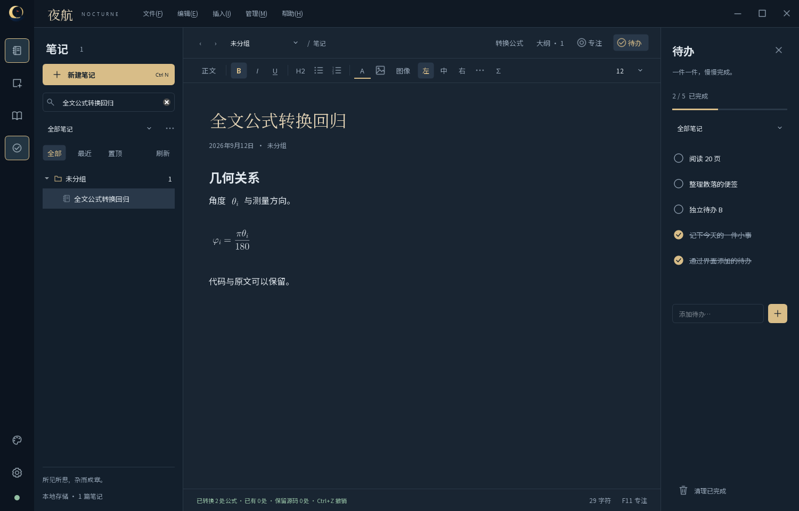
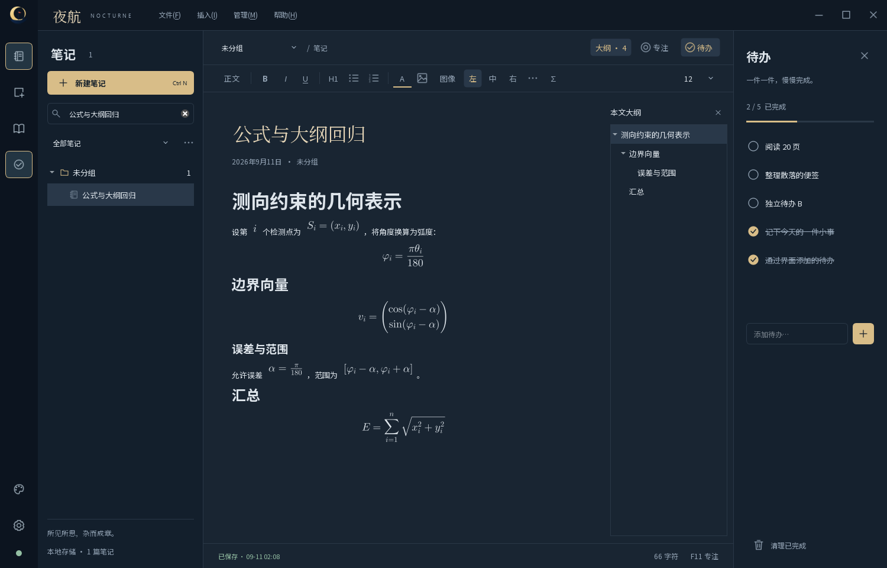
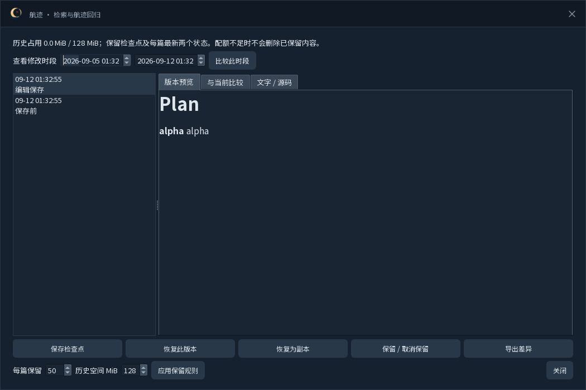
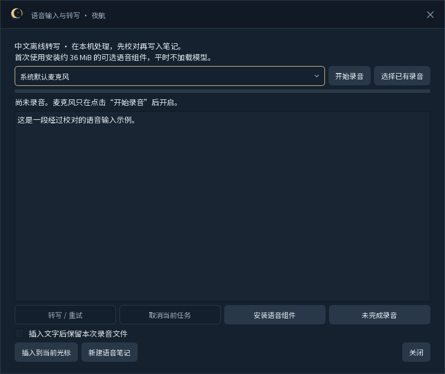

# 夜航（Nocturne） — 开发者文档

> **文档梗概**：说明夜航（Nocturne）当前真实的架构、目录、模块、数据、界面、构建、验证和维护方式；未来方案与正式进度不在本文重复维护。
>
> **具体规划法则**：
>
> 1. 当前实现以代码、配置、测试和可复核运行结果为准。
> 2. SQLite 是笔记与待办的权威数据源；界面内存状态必须通过 `Database` 写回后才算持久化。
> 3. 详细任务和正式进度只在[02-项目规划.md](02-项目规划.md)维护；提交与阶段结果只在[03-开发历史.md](03-开发历史.md)维护。
>
> **最后一次更新时间**：2026-09-12
>
> **更新者**：开发组

---

## 0. 当前基线与硬规则

**当前基线**：`V0.3.0` 在统一资料目录、Markdown、图片、表格、多便签和一致性备份之上，补充外部文档源码编辑、恢复与航迹、阅读导航、模板、AI 交接及可选离线语音。全局组合仍由 `GlobalHotkey` 校验与探测，冲突不覆盖设置；成功后以跨语言 PortableText 写入 `QSettings` 并同步可见提示。

原生界面保留夜航 / 雾港 / 月白三套主题、宽阔写作区、可收起待办、专注模式与原创提示窗口。

**本轮开发入口**：[DEV-014—DEV-020](03-开发历史.md#22-v030-本地文档工作区)，数据库为 schema v7；同时集成此前 [DEV-021 公式与树状导航](03-开发历史.md#21-数学公式与树状导航工作区迭代) 及图片交互、对齐和外部目录对接。交付进度以项目规划为准，历史公开 `V0.2.0` 不包含这些能力。

**公开发布入口**：[falling-feather/Nocturne](https://github.com/falling-feather/Nocturne)；本轮发布准备与验收由 [REL-007](03-开发历史.md#312-v030-本地文档工作区集成) 维护。

**硬规则**：

1. 构建目录、便携包和用户数据库不得进入 Git。
2. 程序运行期间不得把 `notebook.sqlite3-wal` 或 `notebook.sqlite3-shm` 当作可独立删除的缓存。
3. 数据库连接由创建它的线程使用；不得把当前 `QSqlDatabase` 连接直接交给后台线程。
4. 关闭主窗口默认只隐藏到托盘；应用内备份允许在线生成一致性快照，但替换数据库、人工恢复或更新程序时必须从托盘完全退出。
5. 可见品牌使用“夜航 / Nocturne”，但 `QApplication` 的内部组织名、应用名和旧单实例锁继续沿用 `FeatherNote`，不得在没有数据迁移方案时改动，否则既有数据库与设置会被解析到新目录。
6. `assets/nocturne.svg` 是图标权威源；PNG 与 ICO 必须通过 `scripts/generate-brand-assets.ps1` 重建，不得分别手调多个尺寸。
7. 无边框窗口的可交互顶栏控件必须设置 `windowChromeInteractive` 属性；可拖动区域由 `WindowDragArea` 标记，不得把菜单或窗口按钮误判为 `HTCAPTION`。
8. “轻量”必须用查询、启动、呼出、内存和空闲 CPU 数据描述；不把工作集下降或单次体感当作完成依据。
9. 全局快捷键设置只有在系统注册成功且 `QSettings::sync()` 无错误后才算完成；冲突、无修饰键、多段或不支持主键不得覆盖上次有效设置。

---

## 目录

1. [项目与系统定位](#1-项目与系统定位)
2. [总体架构](#2-总体架构)
3. [技术栈与依赖](#3-技术栈与依赖)
4. [文件与目录结构](#4-文件与目录结构)
5. [入口与运行流程](#5-入口与运行流程)
6. [模块与功能实现](#6-模块与功能实现)
7. [接口、数据与状态](#7-接口数据与状态)
8. [页面、布局与操作规范](#8-页面布局与操作规范)
9. [配置与环境](#9-配置与环境)
10. [开发与运行操作](#10-开发与运行操作)
11. [修改与扩展指南](#11-修改与扩展指南)
12. [测试与验证](#12-测试与验证)
13. [维护与故障排查](#13-维护与故障排查)
14. [关联文档](#14-关联文档)

---

## 1. 项目与系统定位

夜航是单进程、单用户、本地优先的 Windows 桌面笔记原型。主窗口负责整理富文本笔记与待办，工具窗口负责快速便签，系统托盘负责后台驻留。当前没有账号、网络服务、手机端、云同步或多人权限边界。

## 2. 总体架构

```text
src/main.cpp
  ├─ 单实例锁、兼容存储身份、可见应用元数据与隔离测试配置
  ├─ Branding + assets/nocturne.qrc/.rc → 窗口、托盘与 EXE 品牌资源
  ├─ Database
  │    └─ QSQLITE → notebook.sqlite3（notes、note_sources、folders、todos、settings、可选 FTS5）
  ├─ BackupManager
  │    └─ 独立 QSQLITE 连接 → VACUUM INTO 快照 + attachments 副本 + backup.json
  ├─ GlobalHotkey
  │    └─ QKeySequence 校验 → Win32 探测注册 → 安全重绑/旧绑定回退
  └─ MainWindow
       ├─ 摘要列表 → 选中后读取正文 → 24 MiB 加权缓存
       ├─ 收舟入册 → 多选/拖动便签 → 正式笔记 + 持久来源关系
       ├─ NoteEditor → 富文本、图片输入与有界图片解码
       ├─ QList<StickyNoteWindow*> → 多枚 notes.kind = sticky
       ├─ WindowChrome → 原生拖动命中、最大化手势与八向缩放
       ├─ 分组筛选、移动与管理
       ├─ 待办列表
       ├─ QSystemTrayIcon
       ├─ 低优先级后台备份线程与文件菜单入口
       └─ 唤笺快捷键设置与主界面/托盘提示联动
```

`main.cpp` 创建并打开唯一 `Database`，再把其地址交给 `MainWindow`。主列表只查询 `NoteSummary`，不选择 HTML 或纯文本正文；`loadNote()` 仅在选中项的缓存缺失或 `body_revision` 不匹配时读取完整 `NoteRecord`。便签窗口不再随主窗口预创建；每次快捷键按需构造一枚新便签，已有便签从主列表按 ID 重新打开。`MainWindow` 和 `StickyNoteWindow` 在 GUI 线程同步调用数据库；图片作为 PNG 文件写入应用数据目录，HTML 保存本地文件 URL。

`BackupManager` 不复用 GUI 线程的数据库连接。主窗口先同步落盘当前笔记和已开便签，再在独立 `QThread` 中用新的 SQLite 连接执行 `VACUUM INTO`，因此 WAL 正在使用时也能得到单文件一致性快照；随后复制 `attachments/`、用 `PRAGMA quick_check` 复核快照、写入 `backup.json`，最后用目录改名一次性发布。启动五秒后才尝试自动备份，同一自然日已有成功清单时直接跳过，避免抢占启动路径。

`GlobalHotkey` 只接受带至少一个 Ctrl/Alt/Shift/Win 修饰键的单段组合，主键范围是字母、数字、F1—F24 和常用导航键。重绑时先以临时 ID 调用 `RegisterHotKey` 探测占用；探测成功后才短暂释放旧注册并注册新组合，竞态失败则立即恢复旧组合。`MainWindow` 仅在重绑和设置同步均成功后更新按钮、托盘和帮助文案。

缓存刻意保存正文数据而不是多个完整 `QTextDocument`：后者会长期保留排版树和图片资源，与低常驻内存目标冲突。界面始终只保留一篇正在编辑的渲染文档，最近正文按估算 UTF-16 字节数进入 24 MiB LRU 缓存；摘要中的 `body_revision` 负责判断缓存是否仍有效，SHA-256 `content_hash` 负责避免把元数据变化误判成正文变化。

## 3. 技术栈与依赖

| 层级或领域 | 技术 | 版本 | 用途 | 配置位置 |
| --- | --- | --- | --- | --- |
| 语言 | C++ | C++17 | 应用逻辑与平台接入 | `CMakeLists.txt` |
| UI | Qt Widgets | 最低 6.5；已知环境 6.10.1 | 窗口、编辑器、托盘和控件 | `CMakeLists.txt`、`src/` |
| 数据 | Qt SQL、SQLite | 随 Qt 驱动 | 本地持久化、WAL 与事务 | `src/Database.cpp` |
| 平台 | Win32 `user32` | Windows | 全局快捷键、无边框窗口 `WM_NCHITTEST` 接线 | `src/MainWindow.cpp`、`src/StickyNoteWindow.cpp`、`src/WindowChrome.*` |
| 品牌资源 | SVG、PNG、ICO、QRC、RC | 项目内生成 | 多尺寸运行时图标、Windows 图标和版本信息 | `assets/`、`src/Branding.*` |
| 构建 | CMake、Ninja、MinGW UCRT64 | 以本机安装为准 | Release 构建和 CTest | `build.ps1` |
| 打包 | PowerShell、`windeployqt`、`ldd` | 以本机安装为准 | 收集 Qt 插件和运行库 | `scripts/package.ps1` |

## 4. 文件与目录结构

```text
Nocturne/
├── assets/                 # 图标 SVG 权威源、生成的多尺寸 PNG/ICO、QRC 与 Windows RC
├── src/                    # 桌面运行代码
│   ├── main.cpp            # 单实例、数据库和主窗口入口
│   ├── Branding.*          # 中英文品牌、标语和 QIcon 资源入口
│   ├── BackupManager.*     # 一致性快照、附件副本、清单、限频和保留策略
│   ├── Database.*          # SQLite schema 与 CRUD
│   ├── GlobalHotkey.*      # 组合校验、Win32 注册、占用探测与安全重绑
│   ├── MainWindow.*        # 主界面、托盘、快捷键和业务接线
│   ├── NoteEditor.*        # 富文本图片粘贴和拖放适配
│   ├── NotebookTree.*      # 多级目录、折叠状态、笔记与目录拖放
│   ├── DocumentImporter.*  # 独立线程批量导入、编码与来源识别
│   ├── NocturneStyle.*     # 三套主题、应用样式、矢量图标、列表委托与下拉控件
│   ├── NocturneDialogs.*   # 原创弹窗外壳、确认/输入/取色与非系统文件选择
│   ├── StickyNoteWindow.*  # 无边框置顶便签、透明度设置及自动保存
│   └── WindowChrome.*      # 可复用拖动区域与 Windows 八向缩放命中
├── tests/                  # 迁移/持久化、备份、600 篇性能与真实桌面 UI 烟雾测试
├── scripts/                # 品牌资源生成与打包脚本
├── packaging/              # Qt 运行时配置
├── doc/                    # 当前权威项目文档
├── docs/                   # 既有 0.1.0 原型兼容说明
├── CMakeLists.txt          # 构建目标和测试目标
├── build.ps1               # 构建、测试和打包入口
└── README.md               # 测试者入口与备份说明
```

`build/`、`build-*` 与 `dist/` 是生成物，不属于源码。

## 5. 入口与运行流程

1. `main.cpp` 设置组织名和应用名，并以 `QLockFile` 阻止第二实例。
2. `Database::open()` 创建应用数据目录、打开 `notebook.sqlite3`，设置 `busy_timeout`、WAL、`synchronous=NORMAL` 和外键；`user_version` 低于 6 时在事务中幂等补齐表、摘要、哈希、旧便签迁移、`note_sources` 来源表以及 `linked_sources` / `linked_folders` 外部路径表，并删除 schema v2 的 `idx_notes_single_sticky` 唯一索引；高于当前版本时拒绝降级打开。
3. 数据库尝试建立 FTS5 trigram 索引；不可用时自动退回 `LIKE` 搜索。三字及以上查询走 `MATCH`，一至二字查询走兼容回退。
4. `MainWindow` 建立无原生标题栏的一体化顶栏、三栏工作区、托盘和全局快捷键，创建欢迎笔记，只读取笔记摘要与待办；选中笔记时按需读取正文，启动阶段不创建隐藏便签窗口。
5. 标题或正文变化启动约 `650 ms` 的单次定时器；正文哈希不变时不增加 `body_revision`，没有脏状态时不会因切换或退出重复写入。
6. 主窗口关闭或持续最小化时先保存，再清除正文缓存、编辑器排版树和已解码图片；重新打开时才按 ID 恢复当前正文。托盘“退出”保存所有已打开便签、几何状态并结束进程。
7. 正常启动约五秒后尝试一次每日自动备份；快照和附件复制在后台线程执行。退出时若备份尚未结束，程序延后释放数据库，等待当前备份完整收口。
8. “管理 → 收舟入册”先保存所有打开内容，再列出活动便签；用户可勾选并拖动排序、指定标题与分组。数据库在同一事务中创建普通笔记和有序来源关系，失败时不留下半篇合册。
9. 构造主窗口时读取 `shortcuts/newSticky`，无效值退回 `Ctrl+Alt+N`；“管理 → 唤笺快捷键”实时校验输入，应用时探测系统占用，成功后持久化并同步主按钮、托盘和帮助提示。

## 6. 模块与功能实现

| 模块 | 路径 | 职责与边界 | 入口 | 依赖与调用方 | 验证 |
| --- | --- | --- | --- | --- | --- |
| 品牌 | `src/Branding.*`、`assets/` | 统一名称、标语、多尺寸 QIcon、Windows ICO 与版本资源；不负责业务状态 | `NocturneBrand::appIcon()` | `main.cpp`、主窗口、便签、CMake | 标题栏、托盘和 EXE 属性检查 |
| 数据库 | `src/Database.*`、`src/WorkspaceStore.*` | schema v7、升级迁移、摘要/正文分离、哈希版本、目录、来源、待办、外部路径及工作区历史；不负责 UI | `Database::open()` | Qt SQL；由主窗口、便签及导入线程各自连接调用 | 持久化、性能与工作区回归 |
| 本地备份 | `src/BackupManager.*` | 为在线 SQLite 生成一致性单文件快照，复制附件、复核完整性、写清单并按类型清理旧备份；不执行在线恢复 | `BackupManager::create()` | 独立 Qt SQL 连接；由主窗口后台线程调用 | `NocturneBackupTest` |
| 主窗口 | `src/MainWindow.*` | 一体化无边框顶栏、摘要导航、加权正文缓存、分组、编辑器、待办、托盘、快捷键、多便签管理、“收舟入册”对话框与隐藏态重资源释放 | `MainWindow` 构造函数 | `Database`、`NoteEditor`、`StickyNoteWindow`、`WindowChrome` | `NocturneDesktopUiTest` |
| 编辑器 | `src/NoteEditor.*` | Markdown 语义标题、常用快捷格式、文段标记与定位，以及剪贴板和有界图片解码 | `applyHeadingLevel()`、`insertMarkdownText()`、`markSelectionTodo()`、`locateTodo()` | 主窗口与真实 Qt 回归 | Markdown 往返、键入转换、标记恢复及撤销 |
| 目录树 | `src/NotebookTree.*` | 在同一棵树上展示目录和笔记；保留展开状态，发出数据库移动与文件导入请求 | `rebuildFolders()`、`moveRequested`、`filesDropped` | 主窗口；只加载摘要，不创建多份正文 | 嵌套目录、同名子目录、循环拒绝、实际树控件 |
| 文档导入 | `src/DocumentImporter.*` | 流式处理目录，解码文本、转换 Markdown、复制本地图片或保留外部图片路径；普通导入不写回源文件，对接模式保存时写回源文件 | `DocumentImporter::run()`、`--link-project-docs` | 工作线程或无窗口扫描使用独立 Database 连接；主窗口模态进度页仅用于普通导入 | 编码、重复、变更副本、取消、原文件保持、外部路径链接与完整选择窗口链路 |
| 工作区服务 | `src/WorkspaceStore.*`、`src/SourceFile.*` | 历史、草稿、模板、阅读状态，以及原格式读写、独占校验、写入恢复记录；与现有 SQLite 事务协作 | `capture()`、`SourceFile::write()` | 主窗口、导入和恢复界面 | `NocturneWorkspaceTest`、工作区 UI 回归 |
| AI 交接 | `src/AiExchange.*`、`src/AiUi.cpp`、`src/McpServer.cpp` | 选择范围、交接检查点、stdio 工具及确认后应用；不让 MCP 直接写日常库 | `--mcp --session` | 本地交接包、主窗口正常保存链路 | 真实 stdio 子进程、越界、撤销共享与选区保护 |
| 离线语音 | `src/VoiceUi.cpp`、`src/VoiceAudio.*`、`src/VoiceDecode.cpp` | 主动录音、文件解码、可选引擎进程和校对插入 | “插入 → 语音输入与转写” | WinMM、独立 Media Foundation 辅助程序、可选 sherpa-onnx | 公开录音端到端转写；麦克风硬件由用户主动验收 |
| 桌面便签 | `src/StickyNoteWindow.*` | 多枚无边框纯文本窗口；每枚独立保存正文、几何、透明度、打开与置顶状态；防抖持久化并通知主列表 | `summon()`、`flushSave()`、`setPinned()`、`applyOpacity()` | 调用 `Database::note/saveStickyNote(id, text)`，复用 `WindowChrome` | 多开、独立 ID、置顶、透明度、迁移和重启恢复 |
| 窗口框架 | `src/WindowChrome.*` | 标记拖动区域；在 Windows 把边缘映射为八向缩放、把非交互顶栏映射为原生标题栏命中；不管理业务按钮 | `WindowDragArea`、`handleNativeHitTest()` | 主窗口与便签的 `nativeEvent()` | 拖动、双击最大化和边缘缩放 |
| 全局快捷键 | `src/GlobalHotkey.*` | 规范化与校验单段组合，探测 Win32 占用，切换注册并在失败时恢复旧绑定；不持久化 UI 设置 | `setSequence()`、`validate()` | 主窗口设置对话框、`user32` | `NocturneDesktopUiTest` 真实双窗口占用回归 |
| 构建打包 | `build.ps1`、`scripts/generate-brand-assets.ps1`、`scripts/package.ps1` | 纯英文中间目录、品牌资源生成、CTest、从 CMake 自动读取包版本和便携依赖收集 | PowerShell 参数 | CMake、Ninja、Qt 工具链 | Release 构建与包启动 |

## 7. 接口、数据与状态

| 方法或事件 | 调用方 | 输入 | 输出 | 失败行为 | 实现位置 |
| --- | --- | --- | --- | --- | --- |
| `Database::listNoteSummaries()` | 主窗口 | 搜索文本、分组筛选 | 不含正文的 `NoteSummary` 列表 | 返回空列表并填写错误 | `src/Database.cpp` |
| `Database::note()` | 主窗口 | 笔记 ID | 可选完整笔记 | 未找到返回空可选值 | `src/Database.cpp` |
| `createNote/updateNote/renameNote/softDeleteNote` | 主窗口 | 标题、HTML、纯文本或 ID | ID 或成功状态 | 事务回滚并填写错误 | `src/Database.cpp` |
| `listFolders/createFolder/renameFolder/deleteFolder/moveNoteToFolder` | 主窗口 | 分组名、分组 ID 或笔记 ID | 记录、ID 或成功状态 | 删除分组时笔记回到未分组 | `src/Database.cpp` |
| `stickyNote/saveStickyNote` | 兼容接口、便签窗口 | 可选便签 ID、纯文本 | 第一枚兼容便签或指定便签 ID | 保留脏状态并显示失败；指定 ID 只更新对应 `kind=sticky` 行 | `src/Database.cpp` |
| `BackupManager::create()` | 主窗口、备份测试 | 自动/手动类型、可选时间与保留数 | 成功、是否新建、目录、清理数量或错误 | 失败时删除本次 `.partial` 目录，不发布残缺备份 | `src/BackupManager.cpp` |
| `collectStickyNotes/noteSources` | 收舟入册对话框、持久化测试 | 有序便签 ID、标题、目标分组或合册 ID | 新普通笔记 ID 或有序来源记录 | 非便签来源、目标分组或任一写入失败时事务回滚；不删除源便签 | `src/Database.cpp` |
| `GlobalHotkey::setSequence()` | 主窗口设置对话框 | 经校验的单段 `QKeySequence` | 注册成功或含冲突/回退原因的失败 | 探测失败不释放旧绑定；切换竞态失败尝试恢复旧绑定 | `src/GlobalHotkey.cpp` |
| `imagePasted/imageFilesDropped` | `NoteEditor` | 图片或路径 | Qt 信号 | 不支持的 MIME 交回 `QTextEdit` | `src/NoteEditor.cpp` |

当前数据库位于 `QStandardPaths::AppLocalDataLocation`：

| 表 | 权威内容 | 删除规则 |
| --- | --- | --- |
| `notes` | 分组、类型、标题、HTML、纯文本、摘要、正文版本、SHA-256 哈希和时间 | `deleted_at` 软删除；允许多条活动 `kind=sticky` 记录 |
| `folders` | 分组名称、可选父级和排序 | 删除时笔记移回未分组，子组父级置空 |
| `todos` | 待办文本、完成状态和排序 | 清理已完成时物理删除 |
| `settings` | 兼容保留的小型键值 | 旧 `quick_note` 在升级事务中迁移后删除；窗口设置使用 `QSettings` |
| `note_sources` | 合册笔记到源便签的稳定来源关系、入册顺序和源更新时间 | 删除合册记录时级联清理关系；源 ID 作为历史事实保留 |
| `todo_links` | 待办 ID、来源笔记 ID、稳定 anchor、active 状态 | 删除待办或笔记记录时级联；正文撤销标记只改变 active，重做可恢复原待办 |
| `import_sources` | 来源文件路径、原始字节哈希与导入笔记 ID | 同一来源同一内容跳过；新内容另存笔记；软删除后的相同来源可重新导入 |
| `import_folders` | 来源目录路径与夜航目录 ID | 重复导入复用已有目录；删除对应目录时清理映射 |
| `notes_fts` | 可选 FTS5 外部内容索引 | 由 `notes` 触发器维护；不可用不阻止数据库启动 |

图片文件位于同一数据根目录的 `attachments/`。数据库和附件目录共同构成完整用户数据。

备份位于数据根的 `backups/NocturneBackup-{auto|manual}-<本地时间>-<短随机值>/`。每份成功备份包含 `notebook.sqlite3`、可选 `attachments/` 和 `backup.json`；清理器只识别名称合法、不是符号链接且带清单的夜航目录。自动备份保留 7 份，手动备份保留 10 份，两个队列互不淘汰。

## 8. 页面、布局与操作规范

### 8.1 窗口与操作

| 页面或窗口 | 入口 | 布局区域与主要组件 | 状态与操作 | 实现文件 |
| --- | --- | --- | --- | --- |
| 主窗口 | 程序启动、托盘打开 | 52 px 顶栏；64 px 工具轨；280 px 多级目录树；中央写作区；260 px 待办 | 原生拖动、最大化/还原、缩放与关闭到托盘；树中展示目录与笔记标题，提示中显示摘要和时间 | `src/MainWindow.cpp`、`src/NotebookTree.cpp` |
| 编辑器 | 选中笔记 | 顶部移动分组/专注/待办；46 px 格式栏；32 px 标题、日期/分组、正文、保存状态与字符数 | 普通笔记可编辑；便签正文只读，提供“编辑便签”按钮重开独立窗口 | `src/MainWindow.cpp`、`src/NoteEditor.cpp` |
| 专注布局 | `F11`、编辑区“专注”、设置菜单 | 收起目录、待办与格式栏；写作列最大 940 px，居中 | `F11` 或 `Esc` 返回；不重建编辑器，不改变选区、正文和撤销记录 | `MainWindow::toggleFocusMode()` |
| 桌面便签 | 全局快捷键、工具轨第二项、托盘、列表右键 | 原创月舟顶栏、钉住/设置/关闭；24 px 内边距正文；底部保存状态和缩放握柄 | 多开、每枚独立置顶/透明度/位置；跟随主题，不改变内容或透明度 | `src/StickyNoteWindow.cpp` |
| 确认与信息窗口 | 删除、备份说明、启动错误、帮助等 | 原创 48 px 可拖动标题栏、月舟图标、标题/正文、主题按钮 | 删除默认取消；关闭或 Esc 不确认操作；提示文字可选择复制 | `NocturneDialogs::question/information/critical()` |
| 新建/重命名分组 | 管理菜单、目录“…” | 原创标题栏、明确字段标签、输入框与保存/取消 | 空白输入不能保存；取消不返回新值 | `NocturneDialogs::getText()` |
| 文字颜色 | 格式栏 A | 原创 18 色色板、HEX 输入、应用/取消 | 无效颜色禁止应用；不调用 Windows 原生取色窗口 | `NocturneDialogs::getColor()` |
| 收舟入册与唤笺快捷键 | 管理菜单、工具轨/设置菜单 | 复用 `NocturneDialog` 原创外壳；内部内容各自排版 | 原有多选/排序、来源保留、热键冲突和回退逻辑不变 | `src/MainWindow.cpp`、`src/NocturneDialogs.cpp` |
| 文件选择 | 导入、导出、插入图片 | Qt `DontUseNativeDialog` 文件浏览器，加夜航原创标题栏和统一样式 | 保留目录浏览、多选、扩展名和格式筛选；覆盖已有文件走原创确认框 | `NocturneDialogs::getOpenFileName/getOpenFileNames/getSaveFileName()` |
| 搜索空状态 | 搜索无结果、当前分组无笔记 | 月舟图标、原因文案与“写下第一句” | 可以清空搜索或直接新建；不显示失效编辑内容 | `MainWindow::updateDocumentInfo()` |

标题框直接承担笔记重命名，`F2` 和列表右键保留显式入口。目录组合框筛选分组，编辑区顶部组合框移动当前笔记；`Ctrl+Shift+G` 新建分组，`Ctrl+Shift+B` 打开收舟入册，`Ctrl+K` 打开目录并聚焦搜索。搜索采用 180 ms 防抖，输入停顿 650 ms 后保存。状态栏使用“已保存 / 正在编辑”等面向用户的文案，不再显示缓存、按需加载等内部术语。

默认窗口为 1440 × 900，常规最小尺寸为 920 × 600；启动按当前屏幕可用区域限制尺寸并调整位置。宽度低于 1200 时默认收起待办；用户手动打开待办时，暂时让它替换目录，保障编辑区宽度。低于 1080 时目录缩到 242 px；屏幕可用宽度低于 900 时优先保留写作区。专注模式保持原生窗口行为，不模拟浏览器全屏。

文件菜单保留立即备份与打开备份目录；左下设置菜单增加这些快捷入口。关闭主窗口仍是隐藏到托盘，完全退出通过托盘进行。恢复资料仍须先退出应用，不在数据库打开期间覆盖活动文件。

### 8.2 三套视觉系统

| 主题 ID / 名称 | 编辑区 | 工具轨 | 目录 | 文字 | 强调色 |
| --- | --- | --- | --- | --- | --- |
| `night` / 夜航 · 墨蓝暖金（默认） | `#192532` | `#0C141F` | `#131F2C` | `#DEE5EB` | `#D8BD88` |
| `harbor` / 雾港 · 青灰银月 | `#182C30` | `#0C1C20` | `#132529` | `#D9E8E5` | `#A5C9BC` |
| `moonlight` / 月白 · 清朗纸页 | `#F4F6F8` | `#172B3A` | `#E9EEF2` | `#253846` | `#526F83` |

三套主题共用一棵 QWidget 树、相同布局与同一份业务逻辑，切换只更新应用调色板、样式与图标，并持久化 `appearance/theme`。菜单、便签、对话框都由应用级样式统一更新，不各自保存另一份主题状态。

UI 优先使用已安装的 Noto Sans SC，回退到微软雅黑等中文无衬线字体；标题优先 Noto Serif SC，回退到中宋/宋体。安装包不打包额外字体。正文保留用户自己的富文本字体和字号；标准正文默认 12 pt。控件主要使用 5—7 px 小圆角、1 px 分隔线、3 px 左侧选中标记。图标由 `NocturneUi::Glyph` 在 24 单位画布上用 QPainter 绘制，并提供 1/2/3 倍像素版本。正式月舟品牌图标继续来自 `assets/nocturne.qrc`。

概念稿仅作为开发文档图片保存，不进入应用资源；运行时没有装饰背景位图、持续动画、浏览器内核或新增第三方依赖。字符统计读取 `QTextDocument::characterCount()`，不在每次键入时复制整篇正文。

### 8.3 富文本与弹窗维护约束

`NoteEditor::refreshTheme()` 通过 `QSyntaxHighlighter` 的显示层格式覆盖，使无配对背景的过暗文字在深色主题下、过亮文字在浅色主题下可见；保留 HTML 中作者原来的颜色、光标选区与撤销栈。带显式背景色的文字保留作者的配色组合。这不是富文本格式转换，不得把显示层颜色回写数据库。机制参考 [Qt 的 QSyntaxHighlighter 文档](https://doc.qt.io/qt-6/qsyntaxhighlighter.html)。

新增提示、确认和字段输入应使用 `NocturneDialogs`；复杂表单使用 `NocturneDialog::body()` 容纳内容布局，标题栏和边框由基类统一维护。禁止在其上再创建第二份外层布局。文件浏览采用 Qt 非系统实现；只有顶栏、按钮、确认与颜色窗口由项目自行构建，并未重写文件系统浏览模型。

### 8.4 视觉对照与验证证据

本节记录 2026-09-05 的界面重设计基线；2026-09-06 新增的目录树与文段待办见下一节。

本轮使用内置 Image Gen 生成[夜航主屏概念](image/Nocturne-redesign-concept.png)及[雾港、月白和便签概念](image/Nocturne-theme-concepts.png)。最终视觉方向和提示词归档在[任务设计记录](02-项目规划.md#43-dev-007-视觉方向与生成记录)。真实截图来自隔离 UUID 数据目录中的 QWidget backing-store，使用 `QWidget::grab()`；此项目是原生 Qt 应用，Browser/IAB/Playwright 不适用于其控件验证。

已在同一轮通过 `view_image` 对照概念与最新实装截图。主窗口逻辑尺寸为 1440 × 900，Windows 实际缩放为 150%，截图为 2160 × 1350；紧凑窗口为 960 × 680，截图为 1440 × 1020。生成主概念图是 1586 × 992，因此按相同整体比例比对，未宣称逐像素相同。Qt 在本机仍报告 1.5 倍缩放；未将额外进程级缩放尝试计作 100% DPI 验证。

| 对照点 | 概念证据 | 实装与修正 |
| --- | --- | --- |
| 主结构 | 工具轨、目录、写作区、可收起待办 | 四区域已实装；紧凑模式和专注模式真实切换 |
| 配色 | 墨蓝暖金、青灰银月、清朗纸页 | 三套集中令牌已应用；主窗口、便签和弹窗跟随选择 |
| 字体层级 | 文档大标题、低干扰元数据、清晰正文 | 32 px 衬线标题、12 px 元数据、12 pt 默认正文；实际富文本格式受作者控制 |
| 工具和图标 | 细线图标、单行格式栏、色彩提示与下拉箭头 | 项目绘制图标；修复字号框内边距挤压、下拉箭头不可见及取色按钮强调状态 |
| 列表与空间 | 连续列表、选中左线、单行摘要、留白 | 修复泛化 QListView 样式造成的多余背景矩形；目录和待办保持连续平面 |
| 弹窗 | 用户追加要求为原创界面 | 确认/输入/颜色/快捷键/合册统一原创标题栏；文件浏览取消 Windows 原生窗口 |
| 首屏文案 | 笔记、搜索、新建、专注、待办、品牌标语 | 核心文案一致；笔记摘要、日期、字符数和保存时间取真实数据，未固定概念中的样例数值 |

保留的有意差异：使用项目正式图标而非生成图中的近似图形；字数、时间和摘要由真实内容计算；提供直接“正文”按钮及单独 H1；正文子标题保持用户富文本格式，不强制覆盖为概念图字体或金色。未保留影响主要操作的裁切、重叠或不可读问题。已按所采用概念核对布局、配色、字形层级、图标、间距、文案及窗口状态。

实装截图：[夜航](image/Nocturne-redesign-night.png)、[雾港](image/Nocturne-redesign-harbor.png)、[月白](image/Nocturne-redesign-moonlight.png)、[专注](image/Nocturne-redesign-focus.png)、[紧凑窗口](image/Nocturne-redesign-compact.png)、[搜索空状态](image/Nocturne-redesign-empty.png)、[便签](image/Nocturne-redesign-sticky.png)、[浅色便签](image/Nocturne-redesign-sticky-moonlight.png)。

弹窗截图：[确认](image/Nocturne-redesign-confirmation.png)、[输入](image/Nocturne-redesign-input.png)、[颜色](image/Nocturne-redesign-color.png)、[快捷键冲突](image/Nocturne-redesign-hotkey.png)、[收舟入册](image/Nocturne-redesign-collect.png)。

### 8.5 文档与目录工作流（DEV-008）

**当前状态**：本节基础功能从 v0.2.0 开始集成；历史预览目录已归档停用。当前程序使用 schema v7，旧公开程序不应直接打开已升级的数据库。

| 需求 | 操作入口 | 实际行为 |
| --- | --- | --- |
| 分级标题 | 格式栏 H 菜单、正文右键、`Ctrl+Alt+1—6` | 设置真正的 H1—H6 段落级别；“正文”恢复普通段落；HTML 与 Markdown 保留标题语义 |
| Markdown 输入 | 在行首输入 `#`—`######` 后按空格；`-`、`*`、`1.`、`>` 后按空格 | 自动转换标题、列表或引用；标题末尾回车恢复正文；空引用回车退出引用 |
| 其他格式 | 格式栏“…” | 引用、代码块、删除线、链接，以及“按 Markdown 插入”多行输入窗口；纯文本 Markdown 粘贴会识别常见块语法 |
| 行内 Markdown | 键入 `**粗体**`、`*斜体*`、行内代码或 `~~删除线~~` | 转为富文本；复杂内容可用 Markdown 插入窗口或文件导入，解析采用 Qt 的 GitHub Markdown 方言 |
| 文段待办 | 选中普通文字后右键“设置待办”或 `Ctrl+Shift+T` | 文段显示深底灰字，完成后加删除线；右侧圆圈切换完成状态，双击文字定位源文段 |
| 取消标记 | 在标记文段内右键“取消这段待办标记”，或格式栏“…” | 撤销标记后对应待办隐藏；撤销/重做会恢复原关联；正文前面增删文字不会使定位偏移 |
| 多级目录 | 左侧树形导航及右键菜单 | 展开/折叠、记忆状态、新建子目录、重命名、移动；拖放目录和笔记调用数据库后再刷新；拒绝父目录移入自身或后代 |
| 文件导入 | “文件 → 导入文档…” | 多选 MD/Markdown/TXT，保留 HTML/HTM 导入；也可把文件拖到目录树或正文中 |
| 文件夹导入 | “文件 → 导入文件夹…”或目录右键 | 递归把文件夹建为目录、文件建为笔记；同一来源目录复用既有映射，避免再次导入产生空重复目录 |

`NotebookTree` 复用已有 `folders.parent_id`，只保存摘要与树节点，不为每篇笔记创建编辑器。父目录筛选通过递归 CTE 包含后代笔记。不同父目录下可以有同名子目录；移动产生同级重名时拒绝。分组选择器显示完整层级路径。原删除目录规则继续保留笔记：直属笔记移到未分组，子目录提升到顶级；若提升后会产生重名，事务回滚，需先移动或重命名子目录。

文段待办用 `nocturne-todo:<UUID>` 锚点保存在 HTML，`todo_links` 记录待办、来源笔记和 active 状态。新增关联和正文更新在一个事务中提交，并检查正文版本；后续保存根据锚点同步 active，支持撤销/重做。深底灰字由显示层绘制，不覆写原来的文字颜色；右侧文字保存创建时的选区内容，定位根据稳定锚点查找。包含已有超链接或现有待办的选区暂不重叠标记，以避免覆盖链接。Markdown 导出会清理内部锚点链接并保留文字；待办关系仍以夜航数据库为权威，不承诺跨格式迁移。

`DocumentImporter` 在独立线程使用独立 `Database` 连接，每个文件独立提交。目录与文件均记录来源；同一文件路径和原始字节哈希已有活动笔记时跳过，源文件变化时另存副本，不覆盖已经整理的笔记。源文件与文件夹不被移动或改写，也没有双向同步或文件监视。取消保留已经完成的文档，停止后等待工作线程结束；失败项在结果窗口报告。

导入支持 UTF-8、带 BOM 的 UTF-16，以及 Windows 上的 GB18030。单文本文件上限为 8 MiB；递归深度上限 48。符号链接、隐藏项以及 `node_modules`、`.git`、`.venv` 等目录被略过；不支持的格式计入跳过项。Markdown/HTML 引用的可读本地图片会按内容哈希复制到附件目录，单张原文件上限 20 MiB；无法读取或超出上限的图片引用不保证导入完整，当前重点是简单文本文档。

验证位于 `tests/DocumentWorkflow.cpp`，由真实桌面 UI 回归调用。覆盖目录同名/移动/循环防护、后代筛选、文件和文件夹完整选择窗口链路、编码、坏文件、重复与变更副本、来源保持、取消、Markdown 标题/粗体/代码导出、文段待办保存/撤销/重做/编辑后定位及从保存 HTML 重建编辑器。最新 Release 与 CTest 4/4 通过；600 篇摘要查询中位数约 28.2 ms、P95 31.3 ms，单篇正文读取中位数约 0.12 ms。该数字为本机测试样本，不代表跨机器测量。

实装截图：[多级目录与文段待办](image/Nocturne-documents-workflow.png)、[H1—H6 标题菜单](image/Nocturne-documents-headings.png)。截图使用隔离示例数据，已通过实际 QWidget 渲染核对。

### 8.6 待办明细、单项删除与中文菜单（DEV-009）

正文中仍有效的待办锚点显示下划线，悬停显示手形和“点击查看待办明细”；普通左键点击打开夜航原创明细窗口，展示完整待办内容、完成状态、来源笔记和目录，并提供返回正文、切换完成状态、删除与关闭。拖动距离或选区变化会被判定为文字选择，不触发详情，普通外部链接不通过此入口打开。

右侧待办列表的右键菜单提供查看明细、切换状态、定位正文及“删除这条待办”。`Database::deleteTodo()` 只删除指定 ID，并在事务中通过外键清理关联；笔记正文及其他待办保持不变。删除后当前编辑器移除显示层标记，遗留 HTML 锚点不再作为有效待办链接响应。

`NocturneStyle.cpp` 的轻量 `EditingTranslator` 对 Qt 标准编辑命令做中文翻译，覆盖正文、便签、搜索、标题和对话框输入：撤销、重做、剪切、复制、粘贴、删除、全选及复制链接地址；沿用原控件的快捷键、可用状态和操作绑定。

`tests/DocumentWorkflow.cpp` 新增真实鼠标点击/拖选、详情内容与来源、详情状态切换、右键单项删除、删除保留正文与其他项目、失效锚点不再触发，以及文本框/输入框中文菜单验证。Release 构建及 CTest 4/4 通过。截图：[待办明细](image/Nocturne-task-details.png)、[中文编辑菜单](image/Nocturne-chinese-edit-menu.png)。本轮已在备份正常用户资料和旧程序后，直接替换桌面应用并以正常配置启动；schema 仍为 v5，笔记、目录与待办数量保持。数据快照在资料根的 `backups/Nocturne-before-todo-details-20260906-042406/`，旧程序在仓库的 `dist/runtime-backups/Nocturne-before-todo-details-20260906-042406/`。

### 8.6 图片、图注与表格

`NoteEditor` 通过 `QTextObjectInterface` 接管图片显示，按实际图像比例和正文视口宽度计算占位，不再采用旧 HTML 中不一致的高度；窗口缩放只重新布局。载入、粘贴和插入图片时把图片段落恢复为单倍行高，避免继承正文百分比行高产生大块空白。附件原文件保持不变。

图片单击只选中图片，右键菜单打开原创“图片描述”窗口，留空可移除描述；双击打开原创大图预览，支持适应窗口、原始尺寸、缩小/放大、滚轮缩放和按住左键拖动平移。预览关闭即释放图像。图注存为图片 `ImageAltText` 和图片后带 `nocturne-caption:` 标记的普通段落；同一编辑事务支持撤销，HTML 保存重载可继续修改，Markdown 导出移除内部标记。

“插入 → 表格”、格式栏更多菜单及正文右键均可手动建表，范围为 1—100 行、1—12 列；单元格内右键可增删行列。粘贴标准管道表格、按 Markdown 插入，以及导入 `.md` 均使用 GitHub Markdown 表格解析，HTML 保存保留可编辑单元格，Markdown 导出仍为通用表格文本。不把只有空格对齐、没有分隔行的普通文字猜测为表格。

“选区转为表格”可从插入菜单、格式更多菜单或正文右键使用。选区已有表格时就地补充边框、等分列宽与紧凑段落间距，保留单元格内容和表格外图片/段落；无表格时识别制表符、管道 Markdown 或连续空格分隔的矩形文本，校验 2—100 行与 2—12 列后一次替换。无法明确识别时提示并保持原文，转换和整理均可一次撤销。

`tests/DocumentWorkflow.cpp` 覆盖旧尺寸比例修复、图片行高、图注添加/更新/清空/撤销/HTML 重载、单双击互斥与预览、手动表格和 Markdown 表格往返。界面测试数据保持隔离。

### 8.7 图片缩放与段落对齐（DEV-012）

`NoteEditor` 将用户主动调整后的图片显示宽高写入 `QTextImageFormat`，并在图片 URL 上保留内部 `nocturne-size` 标记，用来区分旧 HTML 中可能不可靠的宽高字段。未手动调整的历史图片仍按附件真实比例和正文宽度自适应；手动调整范围为默认正文宽度的 `10%—200%`，宽高始终按原图比例计算，附件文件本身不变。窗口加载时最多解码附件的 `4096` 像素边，避免为了显示尺寸重复缩放资源；Markdown 导出会移除内部 URL 标记。

工具栏“图像”菜单、正文图片右键菜单提供缩小、放大和比例输入；顶栏直接显示“左 / 中 / 右”对齐按钮，正文右键“段落对齐”也提供相同操作。对选中文本时逐段设置 `QTextBlockFormat`，对图片时设置图片所在段落，因此图片与文字使用同一套持久化段落布局规则。图片单击选中、右键编辑描述、双击大图预览的行为保持一致。

`tests/DocumentWorkflow.cpp` 覆盖旧图片宽高兼容、主动缩放、HTML 重载后的尺寸保持、图片比例与左右/居中对齐、文本多段落对齐及撤销；桌面 UI 使用 `imageToolsButton`、`alignLeftButton`、`alignCenterButton` 和 `alignRightButton` 作为稳定入口对象。

### 8.8 图片交互与外部项目文档对接（DEV-013）

编辑器顶栏直接显示“左 / 中 / 右”三个对齐按钮，按钮作用于选中文本的段落或当前图片所在段落。图片单击只建立图片选区；选区的四边附近可直接拖动改变显示宽度并保持原图比例，右键菜单提供“编辑图片描述”，双击进入原创预览器。预览窗口允许调整窗口大小，滚轮以鼠标位置为中心缩放，按住鼠标左键拖动图片区域可平移查看，原始尺寸、适应窗口和按钮缩放继续保留。

外部文档使用 `linked_sources` 和 `linked_folders` 保存源文件/目录路径、类型与哈希，不把源文件复制进附件目录。扫描模式 `--link-project-docs` 只处理 `D:/代码玩具测试` 下第一层项目的 `doc` 或 `docs`，要求近 60 天内项目或目录有修改，并跳过 `笔记本` 自身和依赖目录。树形目录固定映射为“代码玩具测试 / 项目名 / 详细md文档”，文档目录内的子目录继续保留。当前已建立 14 个项目层级、95 个外部目录映射和 252 条文件链接。Markdown、TXT、HTML 文件在夜航中显示；Markdown/TXT/HTML 的编辑保存会通过 `QSaveFile` 写回原路径，图片引用解析为原文件绝对路径，不建立附件副本。对接前自动生成手动备份；同一源路径重复扫描按哈希跳过，源文件变化时更新同一篇对接笔记。

对接模式只在无日常夜航进程时执行；若当前进程仍在运行，后台任务等待其正常退出，不强制结束或覆盖 SQLite。对接报告写入私有 `dist/artifacts/`，不提交源文件内容。

### 8.9 公式与树状导航（DEV-021）

本节的公式与树状导航基础实现已随 V0.3.0 集成，早期交付证据见[已完成迭代](03-开发历史.md#21-数学公式与树状导航工作区迭代)。同版重发增加下述全文转换能力。

**公式操作**：Markdown 插入、粘贴、导入及外部 MD 路径对接支持 `$...$`、`$$...$$`、`\(...\)` 和 `\[...\]`。分数、上下标、希腊字母、根式、求和、矩阵、分段式和 aligned 环境由本地原生渲染器处理。顶栏 `∑` 或“插入 → LaTeX 公式”打开夜航自有编辑窗口；窄窗口中保留菜单入口。公式右键或双击可重新编辑源码，普通图片的图注及拖动功能保持原有入口。

`MathSupport` 是数学解析、HTML 注释转换和源码导出的唯一实现。持久化使用带源码与行内/块模式的 `nocturne-math:` 图片地址，不把公式扁平化成不可编辑附件；复制、纯文本索引、Markdown 导出均还原源码。代码块、行内代码和转义美元符不作数学转换。复制自网页的 KaTeX/MathML 若含 `application/x-tex` 注释，只取一份源码，避免重复视觉文本。旧笔记保留的明确 TeX 源码可使用全文转换；已经丢失源码的普通文字不作猜测性改写，仍可选区人工编辑公式。

**全文转换（DEV-022）**：点击页头“转换公式”，或“插入／正文右键 → 转换本文全部 LaTeX”，无需全选。标准分隔符、可明确识别的裸命令及方程、矩阵、align 等环境会批量转换；自然语言、代码、链接、路径、Markdown 元数据与既有公式对象跳过。未闭合或渲染不支持的公式保留源码，状态栏显示数量，悬停可查看原因。HTML 的 code/pre 语义以可持久化等宽字体保留，防止复制／重开后误转。

转换由 `MathSupport::convertAllMath()` 统一扫描、校验并按文档位置逆序修改，所有成功修改合为一个撤销步骤，保留原对齐、待办链接及其他图片；没有可修改项时不增加撤销记录。转换前内容保存在航迹。外部 MD/TXT 只对裸公式补充分隔符，经原有安全写回链路保存后显示预览，切回源码可撤销；外部 HTML/HTM 仅转换预览，不将富文本重新序列化覆盖原文件。



渲染依赖由[固定源码和哈希](../scripts/MathRuntime.cmake)构建，数学字体嵌入程序；不安装完整 TeX，也不加载浏览器内核。Qt 6 字体接口与像素单位绘制在适配层处理，使用稳定尺寸的字形轮廓避免本机 FreeType 小字号栅格绘制异常。数学图像缓存上限 8 MiB；过长、过深或不支持的宏显示可编辑源码和错误提示，不执行外部 TeX 命令。这是数学公式支持，不是完整 LaTeX 文档排版器。

**本文大纲**：点击页头“大纲”或 `Ctrl+Shift+O` 展开笔记内侧栏，专注模式中也可使用。`DocumentOutline` 按当前正文真实的 H1—H6 级别建立嵌套树，跳级标题归于最近的较低级标题，重名标题按 QTextCursor 定位；正文编辑后防抖刷新，当前文档内保留折叠状态，切换笔记时清空旧索引。只加粗的普通段落需要先设置为标题。侧栏显隐偏好保存在 `navigation/showOutline`。

**目录选择**：`FolderComboBox` 复用数据库目录 ID 与父目录关系，在归组、筛选、目录移动及收舟入册入口提供同一树形弹出层。点击箭头逐级展开，点击目录名选定；每次打开都从一级目录开始。移动目录时排除自身和后代，避免选择非法目标。主导航树的手动展开记录使用 `navigation/expandedFoldersV2`；初始收起，恢复当前笔记不自动展开，搜索只临时展开结果。




回归入口为[DocumentWorkflow.cpp](../tests/DocumentWorkflow.cpp)，覆盖数学渲染及源码往返、网页公式去重、单步撤销与对齐保留、重名和跳级标题、编辑后位置追踪、目录箭头与选择、搜索后折叠恢复。截图由真实 QWidget 在 offscreen 平台生成；这轮未接管用户桌面，Win32 全局快捷键占用验证在该平台明确跳过。

### 8.10 工作区安全、恢复与航迹

`WorkspaceStore` 与 `Database` 共用 SQLite 连接和事务。schema v7 增加压缩历史、源文件字节缓存、阅读位置与置顶、模板、便签来源和恢复草稿；原 `notes`、目录、待办与来源 ID 保持。V0.3.0 的交付状态以[项目规划](02-项目规划.md#0-当前基线与执行规则)为准。


外部 MD、TXT、HTML 文档打开后提供源码与预览切换；源码是写回依据，富文本预览不参与反向生成原文。`SourceFile` 统一识别 UTF-8/BOM、UTF-16 LE/BE、GB18030 与换行方式，未改动文本保留原字节。Windows 保存使用独占文件句柄，核对载入时哈希后才写入；先在日常资料的 `write-recovery/` 写入原文与新稿的压缩恢复记录，原文件写入及 SQLite 更新完成后清理该记录。失败或冲突保留编辑，并可从恢复中心找回草稿；文件丢失、只读、占用等状态显示在来源栏。

来源栏提供比较、重载与重新关联文件。目录刷新使用 SQLite `settings` 中的 `linked/refreshRoots` 显式路径清单，`linked_folders` 只承担导航与路径映射，不代表递归扫描授权。初次对接具体目录时登记真实扫描根，普通刷新不会新增或扩大范围；从项目容器刷新只取其已登记的文档目录，选中授权目录的下级时进一步缩小范围。旧库缺少清单时停止扫描，不从容器反推范围；目录右键“设置为刷新目录”显示真实路径及递归影响，确认后登记。

遍历拒绝符号链接和越出原始根的规范路径；目录不存在时报告失效，不退回上级。被移出夜航的外部文档不会被刷新自动恢复。取消刷新设置保留笔记；删除目录同步撤销对应设置，重建容器不会恢复旧授权。目录重新关联在同一事务内更新映射、历史与刷新清单，按路径主键处理多个物理目录共用导航节点的既有情况。文件位置由用户管理，不复制迁移。

“编辑 → 航迹”按版本预览、比较时段、导出文本差异，并可恢复原笔记或另存副本。连续编辑在五分钟窗口内合并，保留窗口起点；默认每篇 50 个状态、128 MiB 历史预算，可在界面调整。保留检查点及每篇最新两个状态不被自动清理，因此大量保留内容可能超过预算，界面会显示实际占用。快照独立可还原，图片保留已有引用；恢复正文保留当前目录、待办完成状态与来源关系，恢复前另存检查点。

“文件 → 恢复中心”提供回收站、保存失败草稿、备份中的单篇笔记、未完成源文件写入记录。回收站与备份列表只先加载摘要，选中后加载正文。恢复副本时核对备份中的内部附件；未实际备份的外部源文件不能作为原文件恢复。恢复期间不替换整个日常数据库。



### 8.11 查找、阅读位置、便签来源与模板

`Ctrl+F` 查找、`Ctrl+H` 替换只作用于当前正文或当前源码，可区分大小写、循环定位，全部替换可一次撤销。列表搜索后打开笔记会定位到正文命中处；页头前后按钮支持 `Alt+Left/Right`，左侧提供最近打开和置顶视图。阅读位置同时记录源码／预览模式，切换笔记、关闭及最小化时持久化；隐藏时释放富文本、源码和公式缓存。

正文选段右键“选段生成便签”保留原文并创建独立便签，便签菜单可回到来源笔记和片段；原文发生变化或重复时避免假定旧位置仍准确。待办面板可按来源项目及其下级目录筛选。管理菜单的模板窗口可从当前笔记保存模板，再选择目录生成新笔记，删除模板不会删除已创建笔记。

实现入口：[源码编辑与导航](../src/WorkspaceUi.cpp)、[查找替换](../src/FindBar.cpp)、[恢复与模板窗口](../src/HistoryUi.cpp)、[持久化服务](../src/WorkspaceStore.cpp)。

### 8.12 AI 交接与 MCP

“管理 → AI 交接与 MCP”由用户勾选笔记，可只共享当前选区，并选择是否包含直接引用的图片。交接包包含 Markdown、修改差异、来源及版本清单；选区共享不带相邻正文、全文差异或其他待办。完整交接生成单独保留的“AI交接”检查点，下次交接以它为基线；选区检查点不替换全文交接基线。

`Nocturne.exe --mcp --session <session.json>` 是独立 stdio 进程，在进入日常 GUI、资料迁移和单实例锁之前分流。它不打开日常数据库，也不启动 HTTP 服务，仅访问指定交接目录；六项工具提供范围内列表、文档／选区读取、搜索、变化、图片与修改建议。路径规范化、共享状态及版本校验都在服务端执行。用户停止共享后，进程约一秒内退出；EOF 也释放进程。

`propose_edit` 只写入共享目录中的建议文件。夜航“修改建议”页显示差异，用户确认后再次核对当前共享范围、文档／源文件版本，再经正常保存链路应用；选区建议只替换选区。预览模式下无法对应原文件位置的外部选区是只读共享。修改前版本保留在航迹中，不默认授权模型访问整盘或自动覆盖文件。

复制普通 MCP 配置可供使用 JSON 配置的客户端使用；“复制 Codex 配置”提供 `[mcp_servers.nocturne]` TOML，合并到当前 Codex 配置后重新加载 MCP。默认用户配置为 `~/.codex/config.toml`，也可使用受信任项目的 `.codex/config.toml`，字段与步骤依据[OpenAI 官方 MCP 文档](https://learn.chatgpt.com/docs/extend/mcp?surface=cli)。夜航不替用户修改客户端全局配置。

核心实现：[AiExchange](../src/AiExchange.cpp)、[stdio 服务](../src/McpServer.cpp)、[共享及建议界面](../src/AiUi.cpp)。

### 8.13 可选离线语音

“插入 → 语音输入与转写”或 `Ctrl+Shift+M` 提供麦克风选择、主动录音、导入 WAV/MP3/M4A 等本机录音、停止／取消／重试、校对后插入或新建笔记。当前为中文批量转写；逐句实时显示、多语切换与说话人标注属于后续阶段。

基础包只含录音与进程控制。首次安装下载固定并校验 SHA-256 的 sherpa-onnx 1.13.8 Windows CPU 引擎和 Zipformer-small-CTC 中文 INT8 模型，两份压缩包合计约 35.7 MiB。推理只在独立进程运行，固定两线程 CPU，结束后释放；音频不上传。录音仅在主动点击后使用 WinMM，关闭／取消会停止采集；成功保存后释放录音缓冲，失败录音保留供重试。

`NocturneAudio.exe` 使用 Windows Media Foundation 在独立进程中解码音频，保留单声道 PCM 与真实采样率，由推理引擎处理重采样。媒体组件没有进入笔记主进程的依赖，因此缺少媒体组件不会阻止基本笔记功能启动。当前录音／解码限制及文件大小边界见[VoiceAudio](../src/VoiceAudio.cpp)和[VoiceDecode](../src/VoiceDecode.cpp)。Windows N 等系统可能需要系统媒体组件；可选推理运行库使用供应商的 Windows 构建。

录音及失败任务保存在日常资料 `voice/recordings/`；成功插入后按“保留录音文件”选项处理本次自建录音，用户导入的原始文件保持。模型位于 `voice/model/`，可执行依赖位于 `voice/runtime/`，校验清单为 `voice/installed.json`。安装脚本与供应商许可随包附带，模型不作为基础包大依赖。



已用公开中文 WAV 跑通原生解码、可选引擎、结果校对及插入链路；开发机 5.6 秒样本包含模型加载约 1.8—2.9 秒完成，这是单机样本而非所有机器的保证。本轮没有主动录制用户麦克风，硬件录音需在实际设备上由用户点击验收。组件安装与供给来源见[安装脚本](../scripts/install-voice.ps1)、[模型官方说明](https://k2-fsa.github.io/sherpa/onnx/pretrained_models/online-ctc/zipformer-ctc-models.html#sherpa-onnx-streaming-zipformer-small-ctc-zh-int8-2025-04-01-chinese)。

## 9. 配置与环境

| 配置项 | 位置 | 默认值 | 用途 | 敏感性 |
| --- | --- | --- | --- | --- |
| 主窗口几何 | `QSettings` 的 `main/geometry` | 未设置 | 恢复尺寸与位置 | 非敏感 |
| 外观主题 | `QSettings` 的 `appearance/theme` | `night` | `night` / `harbor` / `moonlight`；未知值使用夜航 | 非敏感 |
| 待办显示偏好 | `QSettings` 的 `appearance/showTodos` | `true` | 宽窗口显示偏好；窄窗口自动收放不修改用户偏好 | 非敏感 |
| 目录展开状态 | `QSettings` 的 `navigation/expandedFolders` | 首次收起 | 记忆目录树的展开 ID | 非敏感 |
| 每枚便签状态 | `QSettings` 的 `stickyNotes/<id>/{geometry,opacity,pinned,open}` | 置顶、`96%`、未恢复 | 分别恢复每枚便签的位置、透明度、钉住与上次打开状态 | 非敏感 |
| 新便签默认透明度 | `QSettings` 的兼容键 `quickNote/opacity` | `96` | 新便签沿用最近一次透明度；旧版本设置继续生效 | 非敏感 |
| 用户数据根 | `%USERPROFILE%/NocturneData/` | 固定日常位置 | SQLite、附件及按需生成的交接和语音文件；测试使用隔离路径 | 可能包含敏感笔记 |
| 本地备份 | 数据根的 `backups/` | 每日一次；自动 7 份、手动 10 份 | 一致性数据库快照、附件和清单 | 与原文同等敏感，未加密 |
| 目录刷新范围 | SQLite `settings` 的 `linked/refreshRoots` | 空清单，不扫描 | 只登记明确对接的实际目录，重关联和删除时同步维护 | 包含本机路径 |
| 全局便签快捷键 | `QSettings` 的 `shortcuts/newSticky` | `Ctrl+Alt+N` | 全局新建一枚桌面便签；以 `QKeySequence::PortableText` 保存 | 非敏感；冲突时不覆盖 |
| UI 隔离测试 | 命令行参数 | `--test-profile` | 使用 Qt 测试路径、独立应用名和独立单实例锁 | 仅开发验证，需 `NOCTURNE_ALLOW_TEST_PROFILE=1` |
| 内部存储身份 | `src/main.cpp` | 组织名与应用名均为 `FeatherNote` | 原位读取 `V0.1.1` 数据与设置；可见品牌独立使用 Nocturne | 关系到用户数据路径 |

正常使用不需要账号密钥或网络凭据；开发测试的进程环境变量见[测试与验证](#12-测试与验证)。

## 10. 开发与运行操作

### 10.1 环境准备

在项目根目录使用 Windows PowerShell。已知环境是 `D:/msys64/ucrt64` 的 CMake、Ninja、MinGW 和 Qt 6.10.1；不得在同一构建目录混用 ABI。

### 10.2 启动与停止

V0.2.0 起，正常资料固定为 `%USERPROFILE%/NocturneData/`，由 `main.cpp` 的 `nocturneDataDirectory` 属性交给 `Database`；测试不设置此属性，继续使用 Qt 隔离路径。`ProfileMigration.h` 在目标数据库不存在时先调用 `BackupManager` 快照，复制到临时目录、调整附件引用并校验后启用，已有目标库不会被旧库覆盖。日常单实例锁位于用户主目录，以避免不同宿主的临时目录重定向。文件菜单新增“打开当前资料目录”。此前 AppData 说明仅适用于旧版迁移来源。

日常应用唯一位置为 `dist/Nocturne-desktop/Nocturne.exe`，桌面“夜航 Nocturne”快捷方式固定指向它，不附带测试参数。正常资料身份继续为组织名与应用名 `FeatherNote`。每次验证后的更新先正常保存退出、备份资料和程序，再替换此目录中的应用并启动；禁止覆盖运行中的 SQLite 文件。

```powershell
& .\dist\Nocturne-desktop\Nocturne.exe
```

停止时使用“文件 → 退出夜航”或托盘退出；关闭主窗口只是隐藏到托盘。旧程序集中归档在 `dist/_archive/`，其中旧 EXE 与 CMD 使用 `.disabled` 后缀停用，不再提供独立用户预览入口。

`scripts/consolidate-profiles.py` 在应用退出后合并独立旧资料；必须指定 `--target`、`--source`、`--backup-root` 和 `--apply` 才写入，省略 `--apply` 为只读预览。脚本先保存一致性数据库及附件备份，保留目标原记录，同名异文另存，重写迁移附件引用，以来源账本保证重复执行不产生副本。含文段待办或合册关系的源库会拒绝，必须另行采用关系完整迁移；不能直接绕过检查。回归入口为 `python tests/ProfileConsolidation.py`。实际用户文章与合并清单只保存在私有资料备份中。

测试与基准参数只有在进程环境显式设置 `NOCTURNE_ALLOW_TEST_PROFILE=1` 时可用；测试窗口品牌显示“夜航 · 测试”。该变量不可持久写入用户环境。开发规则见根目录 `AGENTS.md`。

### 10.3 构建、测试与调试

```powershell
.\build.ps1 -Configuration Release
.\build.ps1 -Configuration Release -Package
```

第一条命令默认构建并运行 CTest；第二条还生成 `dist/artifacts/Nocturne-0.3.0-portable/`。包版本由 `scripts/package.ps1` 从 `CMakeLists.txt` 读取，不能另设一份硬编码版本。失败时先检查 PowerShell 输出中的 CMake、编译器、Qt 插件或 `ldd` 缺失项。

### 10.4 GitHub Windows 公开包

仓库为 `falling-feather/Nocturne`，首次公开版本沿用用户指定的 `0.1.6`，标签为 `v0.1.6`。公开包为 `Nocturne-0.1.6-windows-x64.zip`，完整解压后直接启动 `Nocturne.exe`。公开代码不包含用户数据库、备份、构建目录，文件选择器中带本机用户目录的诊断截图也不进入 Git。

在 MSYS2 构建环境中，可使用以下命令生成独立分发目录，避免碰到桌面端正在运行的目录：

```powershell
.\scripts\package.ps1 -BuildDirectory "$env:LOCALAPPDATA\NocturnePrototypeBuild\Release" -DirectoryName Nocturne-0.3.0-portable
python scripts/collect-runtime-notices.py --package-dir dist/artifacts/Nocturne-0.3.0-portable --verify-sources
```

`collect-runtime-notices.py` 使用 Python 标准库读取已安装 MSYS2 包的所有权、版本和许可，逐个核对分发 DLL 与已安装 DLL 的 SHA-256，复制供应商原始许可并生成 `THIRD_PARTY_SOURCES.json/.md`。`--verify-sources` 核验精确版本源代码包的可达性。构建机器需要 Python 3.11+，最终软件运行不需要 Python；数学资源与可选语音许可另由打包脚本附带。

V0.3.0 分发包包含 125 个文件，基础包不含模型、测试程序或个人资料。版本、ZIP 体积与校验值的唯一交付记录见[本轮历史](03-开发历史.md#22-v030-本地文档工作区)，[Release](https://github.com/falling-feather/Nocturne/releases/tag/v0.3.0) 提供 ZIP、SHA256SUMS.txt 与第三方精确源码入口。历史标签和附件不被新版本覆盖。

## 11. 修改与扩展指南

修改持久化能力时，先在 `02-项目规划.md` 建立任务，再同时调整 `Database.h/.cpp` 和 `tests/DatabaseSmoke.cpp`。schema 变化必须对已存在数据库幂等执行，禁止只修改新建表语句。修改主界面交互时同步 `MainWindow.h/.cpp`；修改便签交互时同步 `StickyNoteWindow.h/.cpp`；改变无边框拖动或缩放规则时优先修改 `WindowChrome.*`，再检查两类窗口的 `nativeEvent()` 接线。修改图片 MIME 接入时同步 `NoteEditor.h/.cpp`。稳定实现形成后更新本文，并在同一提交中更新任务状态和开发历史。

## 12. 测试与验证

2026-09-05，重设计工作区 Release 构建与 CTest `4/4` 通过。扩展桌面测试通过真实控件验证三套主题及持久化、HTML/选区/撤销保持、旧黑色文字显示适配、新建/编辑/自动保存/移动分组、待办完整点击与落盘、专注与紧凑布局、搜索空状态、原创确认取消/输入/HEX 取色、非系统文件选择、便签主题与透明度保持，以及原生最大化/还原。既有多便签、合册来源、热键冲突回退、数据库与备份回归继续通过。预览目录 `dist/Nocturne-redesign-preview/` 为 36 个运行文件、约 76.5 MiB；在 PATH 不包含 Qt 的条件下，以隔离启动基准参数启动并正常退出，退出码为 0。该目录不等同于新的正式发布版本。

CTest 当前有五个入口：`NocturnePersistenceTest` 从真实 `0.1.0` 旧 schema 验证到 v7 的迁移、原有数据及幂等重启；`NocturnePerformanceTest` 测量 600 篇、约 21.5 MiB 的摘要和正文读取；`NocturneDesktopUiTest` 驱动完整 Qt 窗口与真实 MCP 子进程，覆盖文档、图片、公式、目录、安全源文件、恢复、模板、选区及全文 AI 建议、语音校对插入；`NocturneBackupTest` 验证一致性快照、附件与保留策略；`NocturneWorkspaceTest` 定向验证历史合并、检查点、回收站、原编码写入、过期版本拒绝及目录重新关联。

后台验证设置 `QT_QPA_PLATFORM=offscreen`，不接管鼠标键盘；Win32 原生快捷键占用测试在该模式明确跳过。设置 `NOCTURNE_TEST_VOICE_ROOT` 与 `NOCTURNE_TEST_VOICE_SAMPLE` 可在隔离测试资料中启用真实离线文件转写回归，测试不会开启麦克风。这两个变量只属于测试进程，不应写入用户全局环境。

2026-09-12 的 V0.3.0 Release 构建与 CTest 5/5 通过，分发运行库再验证通过；实际入口与私有资料校验见[本轮交付](03-开发历史.md#22-v030-本地文档工作区)。本轮开发机资源样本如下：

| 场景 | 本机实测与口径 |
| --- | --- |
| 263 篇资料、主窗口恢复当前文档 | 私有内存约 216.2 MiB，工作集约 226.7 MiB；约 5.05 秒观察窗 CPU 累计 15.62 ms |
| 5.6 秒中文录音文件，CPU 两线程 | 含模型加载约 1.8—2.9 秒；30 ms 采样观察到推理进程峰值私有内存约 90.6 MiB、峰值工作集约 101.6 MiB；完成后进程退出 |

这些是不同内容负载下的单机观察，不能直接与早期小文档样本比较。当前主界面仍有 Qt、文档布局和公式资源成本，尚未达到低于 100 MiB 的激进目标；语音模型只在使用时增加独立进程占用，不常驻加载。实体麦克风与更多语料的验收仍见[DEV-020](02-项目规划.md#411-语音输入与录音转写)。

2026-09-01 的本机 Release 样本如下；这是回归基线，不是对所有机器的承诺：

| 指标 | 实测 |
| --- | --- |
| 600 篇摘要查询 | 多轮中位数约 `29—36 ms`，P95 约 `32—45 ms` |
| 单篇约 4 KiB 以上正文读取 | 多轮中位数约 `0.09—0.13 ms`，P95 约 `0.18—0.20 ms` |
| 已驻留后打开便签 | 多轮单次样本落在 `117—184 ms`；回归上限 `350 ms` |
| 主窗口进程启动到可见句柄 | 3 次稳态中位数约 `1.09 s` |
| 主窗口可见稳定资源 | 工作集约 `174.2 MiB`，私有内存约 `112.3 MiB` |
| 隐藏到托盘后的稳定样本 | 工作集约 `166.9—167.6 MiB`，私有内存约 `114.5—115.0 MiB`，700 ms 采样窗 CPU 为 `0 ms` |

上述 2026-09-01 样本中，摘要与按需正文路径满足当时规模，便签呼出达到亚 0.2 秒量级。用程序化静态线稿代替背景位图后，便携包减少约 1.7 MiB，稳定私有内存比改动前下降约 10—12 MiB；托盘空闲 CPU 达到事件驱动预期。当时 Qt Widgets、字体和完整主界面的私有内存约 112—115 MiB；隐藏时清除正文和图片可以限制内容增长，却不会让 Qt 堆立即归还给系统。若后续目标要求显著低于 100 MiB，必须评估“托盘控制器与主 UI 生命周期分离”或纯 Win32/DirectWrite A/B 样机，不能用工作集修剪伪装完成。

> 下列清单是操作模板，不代表当前项目进度。

- [ ] Release 构建成功且 CTest 全部通过。
- [ ] 新建、重命名、分组、切换、搜索、缓存命中和重启恢复笔记。
- [ ] 连续两次 `Ctrl+Alt+N` 或 `Ctrl+Shift+N` 打开两枚不同便签，确认各自保存、置顶、透明度和关闭互不影响，并出现在主列表。
- [ ] 主窗口和便签均无原生标题栏；主窗口拖动、双击最大化、按钮还原、边缘缩放和关闭到托盘均正常。
- [ ] 把便签不透明度改为非默认值，退出并重启后数值和窗口视觉均恢复，再调回默认值。
- [ ] 图片粘贴、拖入与选择后可显示，重启后仍可读取。
- [ ] 主窗口关闭后仍可从托盘打开，托盘退出后进程结束。

## 13. 维护与故障排查

| 维护或故障 | 表现 | 准确位置 | 操作或诊断 | 正常结果 | 相关规则 |
| --- | --- | --- | --- | --- | --- |
| 快捷键冲突 | 设置对话框或启动状态提示被占用 | `GlobalHotkey`、`shortcuts/newSticky` | 在“管理 → 唤笺快捷键”录入另一组合，或释放占用后重试 | 对话框确认成功且主按钮/托盘同步 | 冲突失败不得覆盖旧设置或先行释放旧注册 |
| 深色系统主题下菜单文字不可读 | 浅色菜单继承白色系统文字 | `MainWindow::applyTheme()` | 检查 `QMenu` 普通、选中、禁用状态是否均显式声明前景色 | 菜单文字保持深色且分隔线可见 | 自定义浅色背景不得依赖系统前景色 |
| 应用内备份失败 | 状态栏显示快照、附件或清单错误 | 数据根的 `backups/` 与磁盘空间 | 检查目录权限、空间和 `.partial` 是否被安全软件占用后重试 | 新目录含数据库、附件与清单，快照 `quick_check=ok` | 不把 `.partial` 或单独主库当成功备份 |
| 人工恢复 | 需要回退到某份备份 | 文件菜单“打开备份目录” | 完全退出夜航，先另存当前数据，再复制目标快照与附件 | 重启后核对笔记、图片和待办 | 禁止在数据库打开时覆盖活动文件 |
| 中文路径构建失败 | `moc` 无法写中间文件或 `windres` 无法读取 `.rc` | `build.ps1`、`CMakeLists.txt` | 使用纯英文临时目录，并让 CMake 把 RC/ICO 复制到构建目录后编译 | Release 构建通过且 EXE 带图标 | 不把中间资源改回中文源码路径直接编译 |
| 图标修改 | 各尺寸图标不一致或 EXE 图标未刷新 | `assets/nocturne.svg`、`scripts/generate-brand-assets.ps1` | 修改 SVG 后运行生成脚本，再重新配置和构建 | PNG、ICO、窗口与 EXE 使用同一图形 | 不单独覆盖某个 PNG 或 ICO |
| 无边框控件无法点击 | 菜单或按钮被当成可拖动标题栏 | `WindowChrome::handleNativeHitTest()`、控件属性 | 检查交互控件及其父级是否设置 `windowChromeInteractive` | 控件返回 `HTCLIENT`，空白顶栏返回 `HTCAPTION` | 不在每个窗口复制一套命中规则 |
| 便签状态不独立 | 两枚便签互相覆盖内容、位置或透明度 | `StickyNoteWindow::settingKey()`、`Database::saveStickyNote(id, text)` | 检查 ID 是否在首次保存后回写，以及 `stickyNotes/<id>/` 键 | 每枚便签独立保存和恢复 | 不再使用“永远读写第一枚便签”的接口作为窗口主路径 |
| 便签透明度不恢复 | 重启后回到默认值或超出可读范围 | `StickyNoteWindow::applyOpacity()`、`stickyNotes/<id>/opacity` | 检查滑杆范围、逐枚设置与兼容默认键 | 数值限制在 `55%—100%` 并重启恢复 | 不通过编辑区文字颜色 alpha 模拟窗口透明 |
| 便携包缺 DLL | 启动时报模块缺失 | `scripts/package.ps1` | 检查 `windeployqt` 和递归 `ldd` 输出 | 依赖扫描无未解析项 | 不手工复制整套工具链 |

## 14. 关联文档

- [00-项目总纲.md](00-项目总纲.md)
- [02-项目规划.md](02-项目规划.md)
- [03-开发历史.md](03-开发历史.md)
- [04-竞品调研与差异化方向.md](04-竞品调研与差异化方向.md)
- [既有 `0.1.0` 原型说明](../docs/prototype-plan.md)
- [测试者入口](../README.md)
